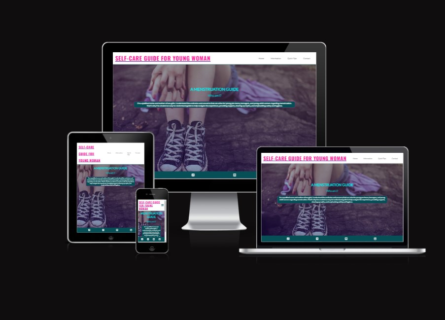
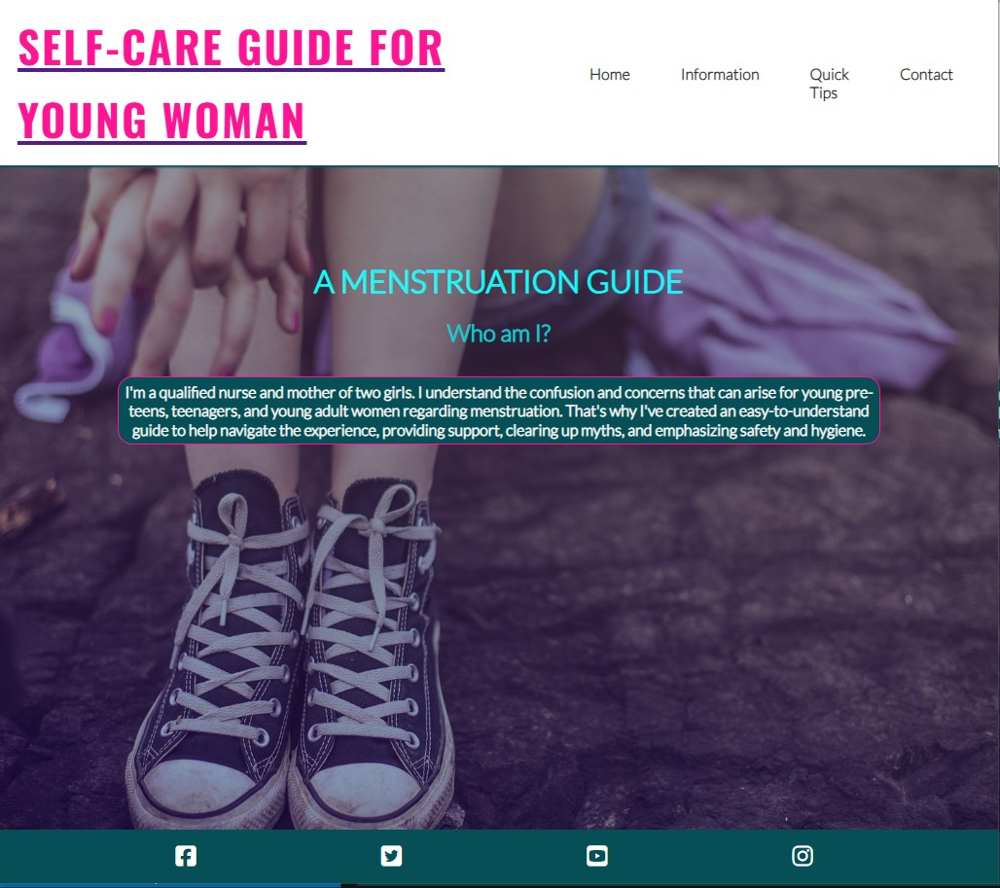
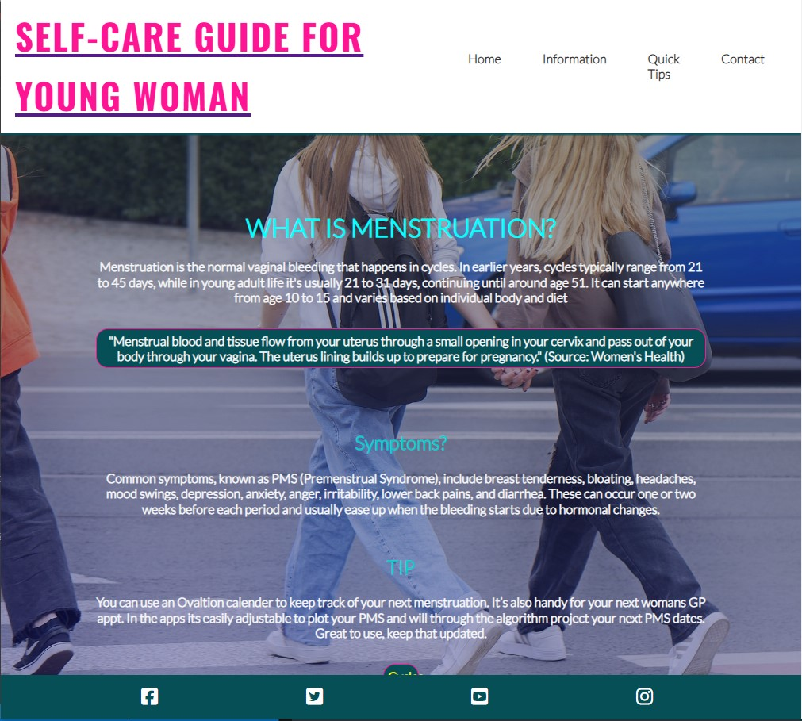
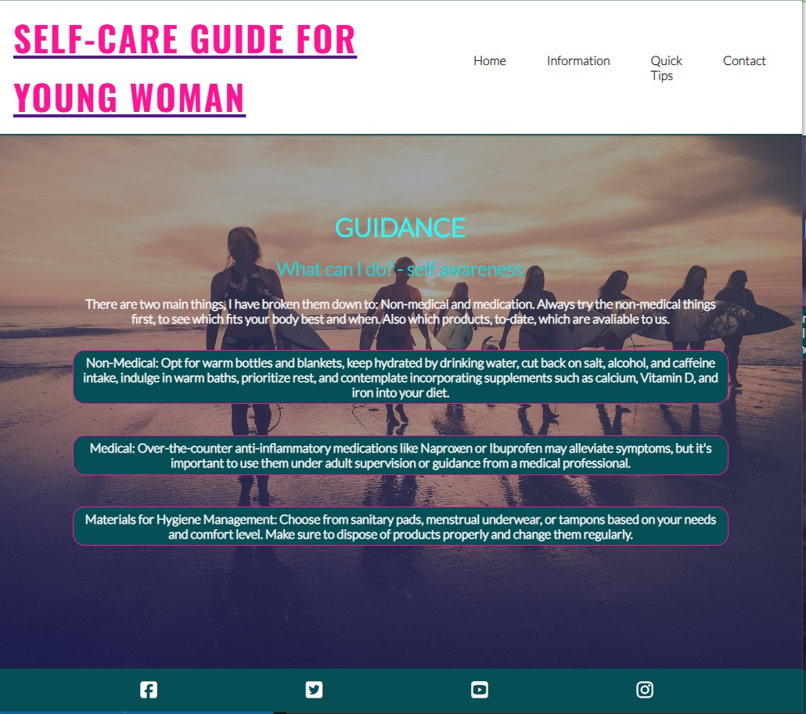
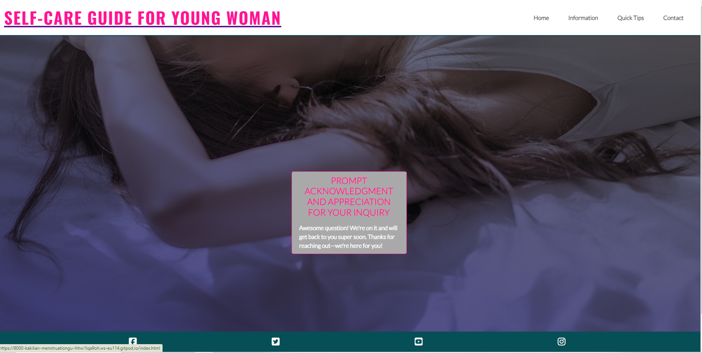
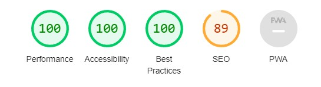
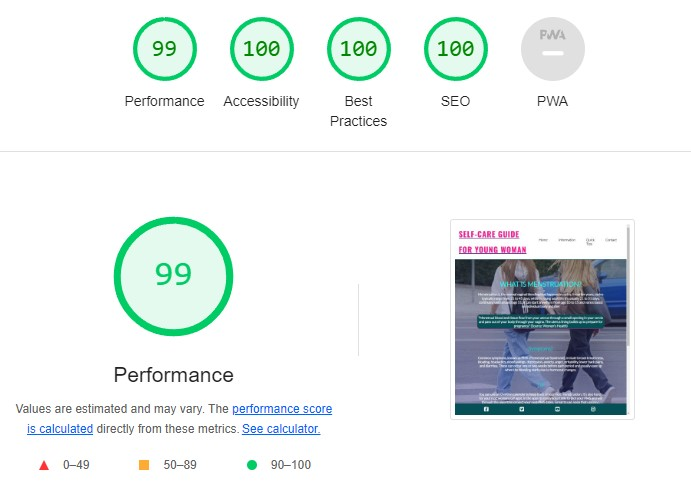

# Self-Care Guide for Young Women on Menstruation

Welcome to the Menstruation Guide for Young Women! This guide is designed to be a supportive resource for pre-teens and young women, providing them with information, guidance, and a sense of community as they navigate through the natural process of menstruation.

This site can be accessed by this [link](https://kakilian.github.io/menstruation-guide-project-1/)

## Table of Contents

1. [Introduction](#introduction)
2. [Balsamiq Usage](#balsamiq-usage)
3. [User Stories](#user-stories)
   - [First Time Visitors Goals](#first-time-visitors-goals)
   - [Returning Visitors Goals](#returning-visitors-goals)
   - [Frequent Visitor Goals](#frequent-visitor-goals)
4. [Features](#features)
   - [Favicon](#favicon)
   - [Font](#font)
   - [Navbar](#navbar)
   - [Homepage](#homepage)
   - [Hero Section](#hero-section)
   - [Highlights Section](#highlights-section)
   - [APP Button - "Cycle"](##app-button---cycle)
   - [Contact Page](#contact-page)
   - [Answer Page](#answer-page)
   - [Colors and Meanings](#colors-and-meanings)
   - [Images and Their Meanings](#images-and-their-meanings)
   - [Footer](#footer)
5. [Deployment](#deployment)
6. [Roadmap](#roadmap)
7. [Testing Responsiveness](#testing-responsiveness)
8. [Using Code from Other Sources](#using-code-from-other-sources)
9. [Acknowledgements](#acknowledgements)

## Introduction

Welcome to the Menstruation Guide for Young Women! This guide aims to empower young women by offering them accurate information about menstruation, debunking myths, and promoting self-care practices. Our goal is to create a safe and supportive space where young women can learn, ask questions, and feel confident about their bodies.

## Balsamiq Usage

## User Stories

### First Time Visitors Goals:
- **Understanding:** Easily comprehensible information without feeling embarrassed or ashamed.
- **Navigation:** Easy navigation to find the desired information or advice.
- **Trustworthiness:** Verify the trustworthiness of the site and read feedback from others who have used it.

### Returning Visitors Goals:
- **Reliability:** Trust in prompt and reliable answers to questions.
- **Support:** Share the website with friends for mutual support.
- **Continued Learning:** Access and understand new content or updates.

### Frequent Visitor Goals:
- **Question Response:** Check if questions have been answered promptly and respectfully.
- **Privacy:** Expect privacy regarding asked questions.

---

## Features

This website consists of 5 pages, including a reply page after contact is made on the webpage.

---

### Favicon

The favicon is simple and clear, indicating the website is made for teens. It is inclusive and designed to help everyone understand what is going on.

---

### Font

I chose accessible fonts like Lato and Oswald. Although I considered a handwritten font, feedback indicated it might not be supported on all mobile phones, especially older models often used by my target audience.

---

### Navbar

The navigation bar is present on all 5 pages for easy user control, it is fully responsive navagation bar includes links to the logo, Home Page, Gallery and Contact/Answer pages. It is identical on all pages, allowing for easy navigation

This section allows the users to navigate from page to page and also to go back one page. By using the dropdown Navigation bar on a mobil phone or clicking on it on a pc.

---

### Homepage

Introduction from myself, and my role in the community as a mother, nurse, and friend. I have picked a faceless photo, as I believe at this age it can be an awkard stage in their lifes. I also tried to keep it simple. With only a short text to get the user to look further into the website. 

---

### Hero Section

Highlights the purpose of the website and its mission, providing a brief overview to help young women understand their bodies.
- Easy to understand, and user relateable content.

---

### Highlights Section

Features key information and advice for young women.
- The information provide to the user is up-to-date, and age thoughtout answers.
- The screen is easy to use, reachable though the toogledown menu tab.
- The colors used are to give the viewer a safe enviroment feeling, so they can reach out if need be.

---

### APP Button - "Cycle"

An integrated APP button helps those interested in tracking their menstrual cycle. Using alt.

![APP from Apple] https://cycles.app
The APP is put in 'raw' form  in my readme#. The APP link was coming up as an error.

---

### Contact Page
[Contact](assets/image/testing-for-project/page-four.jpg)

- Includes a customized input fields, contact form with required fields for visitors to ask questions.
- All fields are required to be fulled out.
- It is a voluntary area to place private/ concerning questions.
- There is a submit button when all fields have been fulled out.

- The page is responsive on all common screen sizes.
- The submit button leads to the response page.

Also there is a disclaimer passage, to make sure that the user will get the best help that is needed at various times. Some countries have specialized doctors for woman.

---

### Answer Page

A confirmation page informs users that their questions will be answered.
- Response page appears after submitting the contact form.
- It contains the thank you message and the promise - to get back intouch with the user.

---

### Footer 

- The footer section includes links to relevant social media sites for this page. The links will open in a new tab, allowing the user easy access to both pages at once.
- The footer is valuable to the user as it encourages them to get connected via social media.

---

### Colors and Meanings

- **Greens:** Symbolize beginnings, new growth, vibrant health, and renewal.
- **Pinks:** Symbolize femininity, compassion, and understanding.

---

### Images and Their Meanings

#### Girl Resting

Symbolizes the importance of relaxation and self-care.

#### Group of Girls

Promotes a sense of community and solidarity.

#### Young Girl

Emphasizes the target audience of pre-teens and teenagers.

#### Surfer Girls

Represents strength, vitality, and empowerment.

---

### Footer

The footer contains social media links, opening in new tabs, for interaction with the user. Code is copied from LoveRunning.

---

## Testing 

Extensive testing was conducted to ensure the website works across different browsers and screen sizes.

### Testing Responsiveness

**Validator Testing**
- **HTML:** Reported 5 errors were found when passing through the official W3C validator.    
     - Indentation, not closed `div` tags. 
     - Images are to be found in css, not html.
     - Author now correctly entered.

- **CSS:** No reported errors were found when passing through the official (Jigsaw) validator.
---

### Bugs

- There are no bugs.
- I have placed my images in css, not html.
- The warning for line 47 adhering to my images. I have ignored, in this project I have put my images into css and not html pages. For easier control. 

---

## Lighthouse

---

## Roadmap

### Interactive Quizzes or Assessments
Develop quizzes related to menstruation and self-care to engage users and provide personalized recommendations.

### Community Forums or Support Groups
Establish forums or support groups where users can share experiences and offer mutual support.

### Questions and Answers
Implement a section where users can view previously asked questions and answers, fostering a sense of community and shared learning.

### Research and Education
Include links to educational resources and ongoing research to empower users with knowledge and promote continuous learning.

### Partner Information
Provide information for siblings, friends, and family members to help them understand and support the primary users.

---

## Deployment

- The site was deployed to GitHub pages. The steps to deploy are as follows:
 - In [GitHub respository](https://github.com/kakilian/menstruation-guide-project-1),
 navigate to the **Settings** tab
 - From the source section drop-down menu, select the **Main** Branch, then click "Save".
 - The page will automatically be refreshed with a detailed ribbon display to indicate the successful deployment.

 The live link can be found [here](https://kakilian.github.io/menstruation-guide-project-1/)
---
### Local Deployment

In order to make a local copy of this püroject, you can clone it.
In your IDE Terminal, type the following command to clone my repositiry:

   - `git clone https://github.com/kakilian/menstruation-guide-project-1.git`

   - Alternatively, if you use Gitpod, you can [click here](https://gitpod.io/#https://github.com/kakilian/menstruation-guide-project-1), which will start the Gitpod workspace for you

---

## Future (personal) Improvements

- Add a custom 404 page;
- Improve the quality of the commit messages ( I am aware that some of them are not meeting the standards expected)
- To better, clearer page mix with images and text color. ( finding a suitable **free** colors page)

---

## Using Code from Other Sources

- **Kevin Powell** (https://www.youtube.com/user/KepowOb)
- **Love Running Project** - (https://learn.codeinstitute.net/courses/course-v1:CodeInstitute+LR101+2021_T1/courseware/4a07c57382724cfda5834497317f24d5/f2db5fd401004fccb43b01a6066a5333/)
- **GitHub Code Insitute** (https://github.com/Code-Institute-Org/ci-full-template)

## Acknowledgements

- **My Daughters:** For helping develop this idea, testing the website, and providing valuable input as my target audience.
- **My Mentor:[Juliia- Mentor]**(https://github.com/luliiaKonovalova) For helping understand the target audience and the message, and supporting the idea. 
- **Slack Buddies and Tutors:[Code Institute]**(https://condeinstitute.net) For helping with coding problems.
- **[Kevin Powell]:** (https://www.youtube.com/user/KepowOb) For valuable coding tutorials and inspiration.
