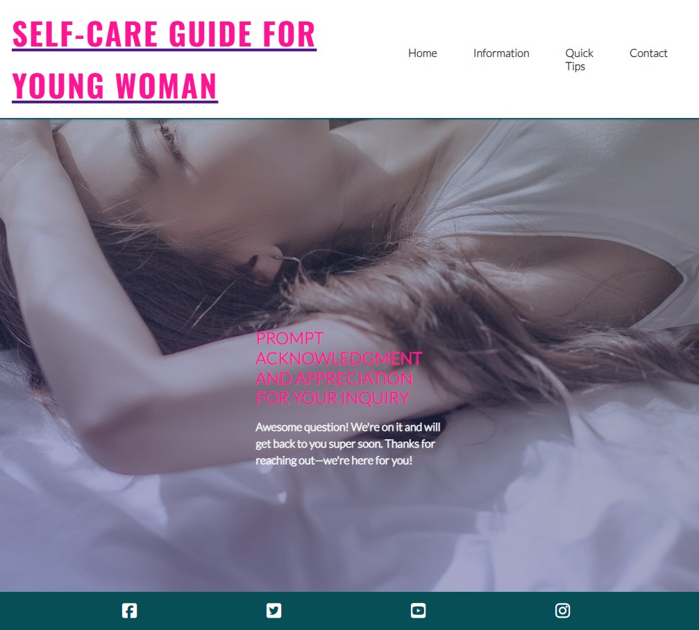

# Self-Care Guide for Young Women on Menstruation

Welcome to the Menstruation Guide for Young Women! This guide is designed to be a supportive resource for pre-teens and young women, providing them with information, guidance, and a sense of community as they navigate through the natural process of menstruation.

## Table of Contents

1. [Introduction](#introduction)
2. [User Stories](#user-stories)
   - [First Time Visitors Goals](#first-time-visitors-goals)
   - [Returning Visitors Goals](#returning-visitors-goals)
   - [Frequent Visitor Goals](#frequent-visitor-goals)
3. [Features](#features)
   - [Favicon](#favicon)
   - [Font](#font)
   - [Navbar](#navbar)
   - [Homepage](#homepage)
   - [Hero Section](#hero-section)
   - [Highlights Section](#highlights-section)
   - [APP Button - "Cycle"](##app-button---cycle)
   - [Contact Page](#contact-page)
   - [Answer Page](#answer-page)
   - [Colors and Meanings](#colors-and-meanings)
   - [Images and Their Meanings](#images-and-their-meanings)
   - [Footer](#footer)
4. [Deployment](#deployment)
5. [Testing Responsiveness](#testing-responsiveness)
6. [Using Code from Other Sources](#using-code-from-other-sources)
7. [Acknowledgements](#acknowledgements)

## Introduction

Welcome to the Menstruation Guide for Young Women! This guide aims to empower young women by offering them accurate information about menstruation, debunking myths, and promoting self-care practices. Our goal is to create a safe and supportive space where young women can learn, ask questions, and feel confident about their bodies.

## Balsamiq Usage

## User Stories

### First Time Visitors Goals:
- **Understanding:** Easily comprehensible information without feeling embarrassed or ashamed.
- **Navigation:** Easy navigation to find the desired information or advice.
- **Trustworthiness:** Verify the trustworthiness of the site and read feedback from others who have used it.

### Returning Visitors Goals:
- **Reliability:** Trust in prompt and reliable answers to questions.
- **Support:** Share the website with friends for mutual support.
- **Continued Learning:** Access and understand new content or updates.

### Frequent Visitor Goals:
- **Question Response:** Check if questions have been answered promptly and respectfully.
- **Privacy:** Expect privacy regarding asked questions.

## Features

This website consists of 5 pages, including a reply page after contact is made on the webpage.

### Favicon

The favicon is simple and clear, indicating the website is made for teens. It is inclusive and designed to help everyone understand what is going on.

### Font

I chose accessible fonts like Lato and Oswald. Although I considered a handwritten font, feedback indicated it might not be supported on all mobile phones, especially older models often used by my target audience.

### Navbar

The navigation bar is present on all 5 pages for easy user control, it is fully responsive navagation bar includes links to the logo, Home Page, Gallery and Contact/Answer pages. It is identical on all pages, allowing for easy navigation

This section allows the users to navigate from page to page and also to go back one page. By using the dropdown Navigation bar on a mobil phone or clicking on it on a pc.

### Homepage

Introduction from myself, and my role in the community as a mother, nurse, and friend. I have picked a faceless photo, as I believe at this age it can be an awkard stage in their lifes. I also tried to keep it simple. With only a short text to get the user to look further into the website. 

### Hero Section

Highlights the purpose of the website and its mission, providing a brief overview to help young women understand their bodies.

### Highlights Section

Features key information and advice for young women.

### APP Button - "Cycle"

An integrated APP button helps those interested in tracking their menstrual cycle. Using alt.
 

### Contact Page
[Contact](assets/image/testing-for-project/page-four.jpg)

Includes a contact form with required fields for visitors to ask questions.
Also there is a disclaimer passage, to make sure that the user will get the best help that is needed at various times. Some countries have specialized doctors for woman.

### Answer Page

A confirmation page informs users that their questions will be answered.

### Footer 

- The footer section includes links to the relevant sozial meida sites for this page. THe links will opne to a new tabe allowing the user easy access to both pages at once.

- The footer is valuable to the user as it encourages them to get connected via sozial media.

## Road Map

- Interactive Quizzes or Assessments
Develop interactive quizzes or assessments related to menstruation, self-care, and health to engage users and provide personalized recommendations based on their responses.

- Community Forums or Support groups
USing establish community forums or support groups outside of the interent where users can connect if they want to share experiences or need more support outside of the website.

- Questions and Answers
Letting users see past questions, where they could possible relate to and would be able to share their experiences.

- Forschung 
Sharing possible links into further education and the ongoing research using it as an educational porthole. Not only to educate but to enpower them along their journey.

- Partner Information
Teaching not only information to the immediate user, but also helping their brothers, friends, family to be informed or "How to help" - "What does this mean" - I got approached by a couple of teenagers in my daughters age asking about what they could do, after looking at APP they found it very informative. So it would be good to have a little corner for them too. 

### Colors and Meanings

- **Greens:** Symbolize beginnings, new growth, vibrant health, and renewal.
- **Pinks:** Symbolize femininity, compassion, and understanding.

### Images and Their Meanings

#### Girl Resting

Symbolizes the importance of relaxation and self-care.

#### Group of Girls

Promotes a sense of community and solidarity.

#### Young Girl

Emphasizes the target audience of pre-teens and teenagers.

#### Surfer Girls

Represents strength, vitality, and empowerment.

### Footer

The footer contains social media links, opening in new tabs, for interaction with the user. Code is copied from LoveRunning.

## Deployment

GitHub Deployment: [Deployment](https://github.com/kakilian/menstruation-guide-project-1/deployments)

## Testing Responsiveness

[html](assets/image/pp1.errors.html.ignoring.png) Reported 5 errors in html. One error I am ignoring on <article class="wrapper-flow"> its saying I need to identify headings- which I do.
 3 reported errors in css that have been corrected.

** In html I have not added the images, as I have them in css so I could adjust the lighting on the images. This also shows as an error. **

Tested for mobile and then on PC using the Lighthouse tool.

## Using Code from Other Sources

- Kevin Powell
- Love Running Project
- GitHub Templates

## Acknowledgements

- **Daughters:** For helping develop this idea, testing the website, and providing valuable input as my target audience.
- **My Mentor:** For helping understand the target audience and the message, and supporting the idea. @Juliia_mentor
- **Slack Buddies and Tutors:** For helping with coding problems.
- **Kevin Powell:** For valuable coding tutorials and inspiration.
